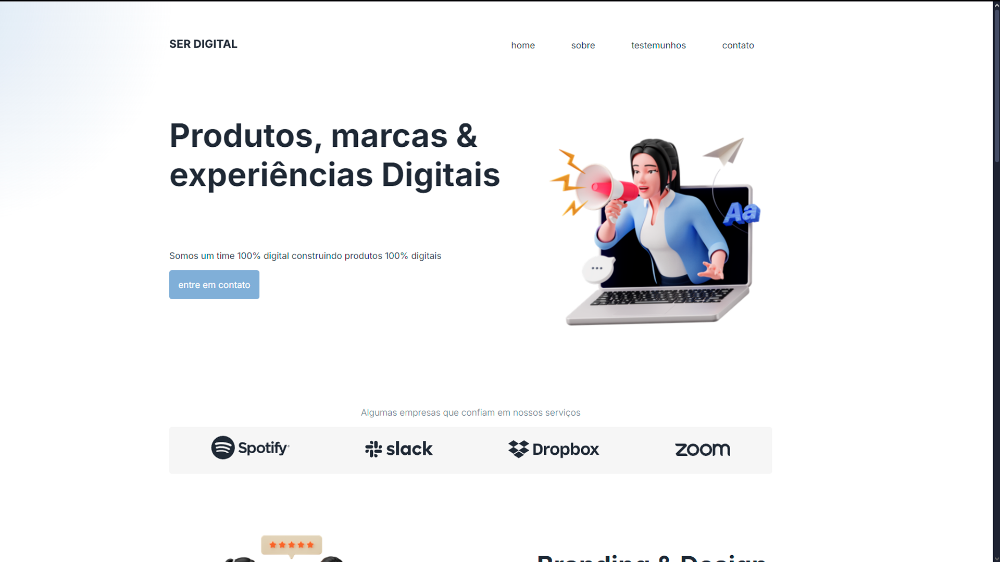

Ser Digital is a study project focused on responsive web design, adapting a webpage to different screen sizes using only HTML and CSS. The goal was to develop more advanced skills in structuring and styling layouts while ensuring a seamless experience across desktops, tablets, and mobile devices. This project challenged me to refine my approach to flexible design, media queries, and adaptive UI techniques.

**[See Page](https://luigineryproject9.netlify.app)**  

